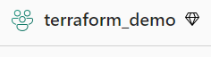

---
# generated by https://github.com/hashicorp/terraform-plugin-docs
page_title: "microsoftfabric Provider"
subcategory: ""
description: |-
  
---

# microsoftfabric Provider


## Example Usage

```terraform
# 1. Specify the version of the Microsoft Fabric Provider to use
terraform {
  required_providers {
    microsoftfabric = {
      source = "ChristopherNagl/microsoftfabric"
      version = "0.4.2"
    }
  }
}

# 2. Configure the  Microsoft Fabric Provider
provider "microsoftfabric" {
  #required
  client_id     = "xxx"
  client_secret = "Txxx"
  tenant_id     = "9xxx"

  #optional but recommended, since many fabric api's dont support service principal yet
  username      = "xx"
  password      = "xx"
}

# 3. Create a worksapce
resource "microsoftfabric_workspace" "example" {
  name = "terraform_demo"
}
```
##### Step 3 Result:

*Figure 1: Step 3 - Result*
```terraform
# 4. assign workspace to capacity
resource "microsoftfabric_workspace_capacity_assignment" "workspace_assignment" {
  workspace_id = microsoftfabric_workspace.example.id
  capacity_id  = "xxxxx"
}
```

*Figure 2: Step 4 - Result of manual assign capacity as workaround*

```terraform
# 5. assign user to workspace
resource "microsoftfabric_workspace_user_assignment" "example_assignment" {
  workspace_id = microsoftfabric_workspace.example.id # Replace with your workspace ID

  users = [
    {
      email          = "AdeleV@3cg7y4.onmicrosoft.com"
      role           = "Member"
      principal_type = "User"
    },
    {
      email          = "f4c6053c-5243-4690-9e1f-f1b5a7558202"
      role           = "Contributor"
      principal_type = "Group"
    }
  ]
}
```

*Figure 3: Step 5 - Result of assign users to workspace*

```terraform
# 6. Connect workaspace with AzureDevOps
resource "microsoftfabric_workspace_git" "example_git" {
  workspace_id = microsoftfabric_workspace.example.id

  git_provider_details = {
    organization_name = "somename"
    project_name      = "ChrisFabric"
    git_provider_type = "AzureDevOps"
    repository_name   = "DevOps"
    branch_name       = "main"
    directory_name    = "/"
  }

  initialization_strategy = "PreferRemote"
}
```

*Figure 4: Step 6 - Result of connect workaspace with AzureDevOps*

```terraform
# 7. Creating reassources for which the RestApi only supports Name and Description so far
resource "microsoftfabric_eventstream" "example_eventstream" {
  workspace_id = microsoftfabric_workspace.example.id
  name         = "Eventstream_demo"
  description  = "An eventstream description."
}

resource "microsoftfabric_ml_experiment" "example_ml_experiment" {
  workspace_id = microsoftfabric_workspace.example.id
  display_name = "ml_experiment_demo"
  description  = "An example_ml_experiment description"
}

resource "microsoftfabric_eventhouse" "example_eventhouse" {
  workspace_id = microsoftfabric_workspace.example.id
  display_name = "example_eventhouse_demo"
  description  = "An example_eventhouse description"
}
```

*Figure 5: Step 7 - Result creating reassources for which the RestApi only supports Name and Description so far*

```terraform
# 8. Create Deployment Pipeline
resource "microsoftfabric_pipeline" "example_pipeline" {
  display_name = "example pipeline"
  description  = "example pipeline"

  workspaces = [
    {
      workspace_id = microsoftfabric_workspace.example.id
      stage_order  = 1
    }
  ]
}
```

*Figure 5: Step 8 - Result of create Deployment Pipeline*
<!-- schema generated by tfplugindocs -->
## Schema

### Required

- `client_id` (String) The Client ID for Power BI API access.
- `client_secret` (String, Sensitive) The Client Secret for Power BI API access.
- `tenant_id` (String) The Tenant ID for Power BI API access.
- `username` (String) The username for Power BI API access.
- `password` (String, Sensitive) The password for Power BI API access.

### Optional

- `token_file_path` (String) The path to the token file, in case that the access token is generated somewhere else

